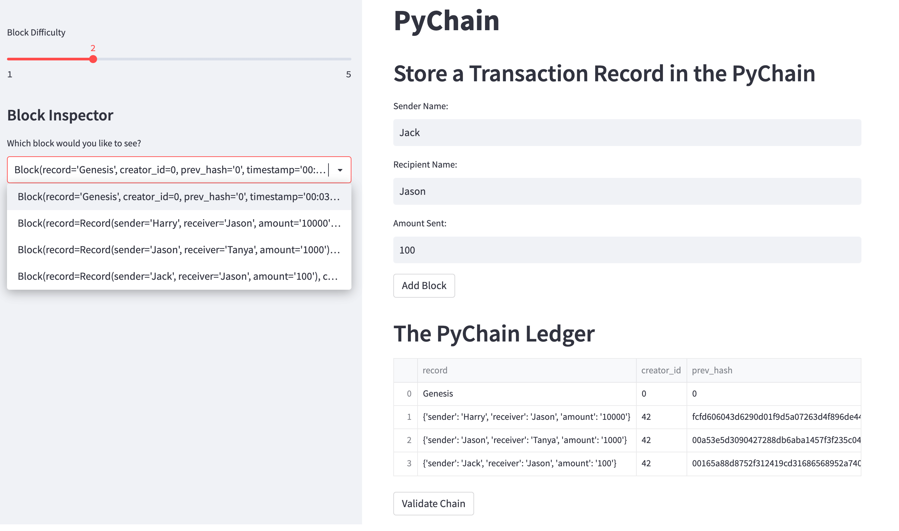
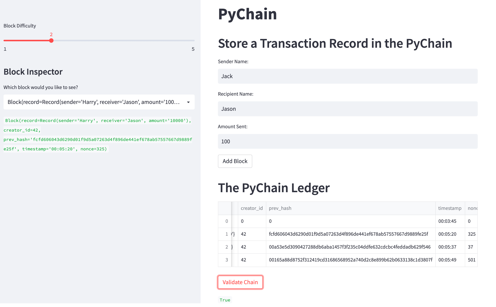
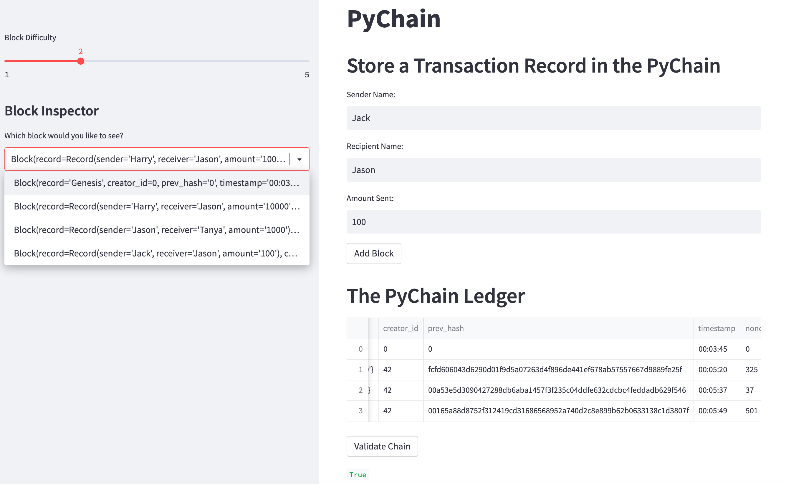
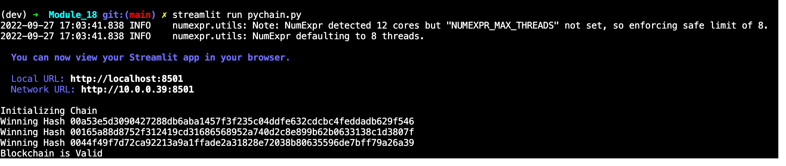

# Module_18 - Blockchain


I'm a fintech engineer who's working at one of the five largest banks in the world.  I was recently promoted to act as the lead developer on our decentralized finance team. My task is to build a blockchain-based ledger system, complete with a user-friendly web interface. This ledger should allow partner banks to conduct financial transactions (that is, to transfer money between senders and receivers) and to verify the integrity of the data in the ledger.

---

## Technologies

This project leverages python 3.9.12 with the following packages:

* [pandas](https://pandas.pydata.org) - Use the Pandas library to display the blocks as dataframes

* [streamlit](https://streamlit.io/) - Allows the python application to be deployable as a shareable web app

---

## Installation Guide

First install the required libraries:

```python
  pip install pandas
  pip install streamlit
```

Before running the application first import the following libraries and dependencies:

```python
  import streamlit as st
  from dataclasses import dataclass
  from typing import Any, List
  import datetime as datetime
  import pandas as pd
  import hashlib
```

---

## Usage

On your command line interface, navigate to the directory that contains this python file, then execute the following command:

```python
streamlit run pychain.py
```

Sample screenshots:



---



---



---

CLI Screenshot:



---

## Contributors

Starter code was provided by UW Fintech Bootcamp.  Updates and analysis by Jason Buckholt.  

---

## License

MIT License

Copyright (c) 2022 Jason Buckholt

Permission is hereby granted, free of charge, to any person obtaining a copy of this software and associated documentation files (the "Software"), to deal in the Software without restriction, including without limitation the rights to use, copy, modify, merge, publish, distribute, sublicense, and/or sell copies of the Software, and to permit persons to whom the Software is furnished to do so, subject to the following conditions:

The above copyright notice and this permission notice shall be included in all copies or substantial portions of the Software.

THE SOFTWARE IS PROVIDED "AS IS", WITHOUT WARRANTY OF ANY KIND, EXPRESS OR IMPLIED, INCLUDING BUT NOT LIMITED TO THE WARRANTIES OF MERCHANTABILITY, FITNESS FOR A PARTICULAR PURPOSE AND NONINFRINGEMENT. IN NO EVENT SHALL THE AUTHORS OR COPYRIGHT HOLDERS BE LIABLE FOR ANY CLAIM, DAMAGES OR OTHER LIABILITY, WHETHER IN AN ACTION OF CONTRACT, TORT OR OTHERWISE, ARISING FROM, OUT OF OR IN CONNECTION WITH THE SOFTWARE OR THE USE OR OTHER DEALINGS IN THE SOFTWARE.